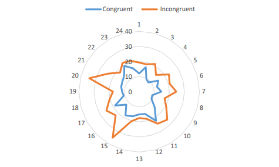

#Project 1: Test a Perceptual Phenomenon
##Background information
In a Stroop task, participants are presented with a list of words, with each word displayed in a color of ink. The participant’s task is to say out loud the color of the ink in which the word is printed. The task has two conditions: a congruent words condition, and an incongruent words condition. In the congruent words condition, the words being displayed are color words whose names match the colors in which they are printed. In the incongruent words condition, the words displayed are color words whose names do not match the colors in which they are printed. In each case, we measure the time it takes to name the ink colors in equally-sized lists. Each participant will go through and record a time from each condition.

**Dataset:** [View CSV](stroopdata.csv)

##Questions for investigation

####1. What is our independent variable? What is our dependent variable?
**Dependent variable:** Time to name ink colours

**Independent variable:** Condition (congruent/incongruent)

####2. What is an appropriate set of hypotheses for this task? What kind of statistical test do you expect to perform?

Ho - Null Hypothesis: ( μi - μc = 0 ) There is no significant difference in the population average response time in viewing the congruent(c) words vs viewing the incongruent(i) words.
Ha - Alternative Hypothesis: ( μi - μc ≠ 0 ) There is a significant difference, positive or negative, in the population average response times.
The Dependent Samples t-Test is the appropriate statistical test as the same subjects are assigned two different conditions. The different conditions are dependent because, in theory, by doing the first test you have some practice doing it and you might have an unfair advantage due to this learning effect in doing the similar type of test second. In addition, we don't have any population parameters provided (so a z-test would not be appropriate here).

####3. Report some descriptive statistics regarding this dataset.

**Congruent**
```
Mean: 14.0
SD: 3.6
```

**Incongruent**
```
Mean: 22.0
SD: 4.8
```

####4. Provide one or two visualizations that show the distribution of the sample data. Write one or two sentences noting what you observe about the plot or plots.

**Completion times of congruent and incongruent tasks**



Congruent tasks appear to be consistently completed faster than incongruent tasks.

####5. What is your confidence level and your critical statistic value? Do you reject the null hypothesis or fail to reject it? Come to a conclusion in terms of the experiment task. Did the results match up with your expectations?
```
Confidence Interval: lower limit = -10.01, upper limit = 2.1
t critical value: 2.07
t statistics: 8.02
Our t statistics is greater than t critical value, so we reject the null hypotheses. We conclude that the congruent/incongruent condition does affect the time it takes to name the ink colors.


####6. Optional: What do you think is responsible for the effects observed? Can you think of an alternative or similar task that would result in a similar effect?

The brain has an image association between the shape of the word and the colour. When there is a mismatch, additional time is necessary for the prefrontal cortex to process the information and decide on its meaning.

A similar effect would likely be observed if the participants were shown words of the correct colour but the wrong text. My hunch, however, is that the difference would be less pronounced as I’d expect the visual colour representation to be more ingrained in the brain that word shape associations.
